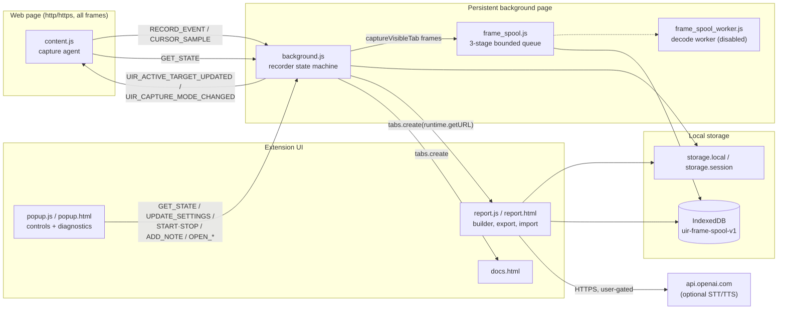
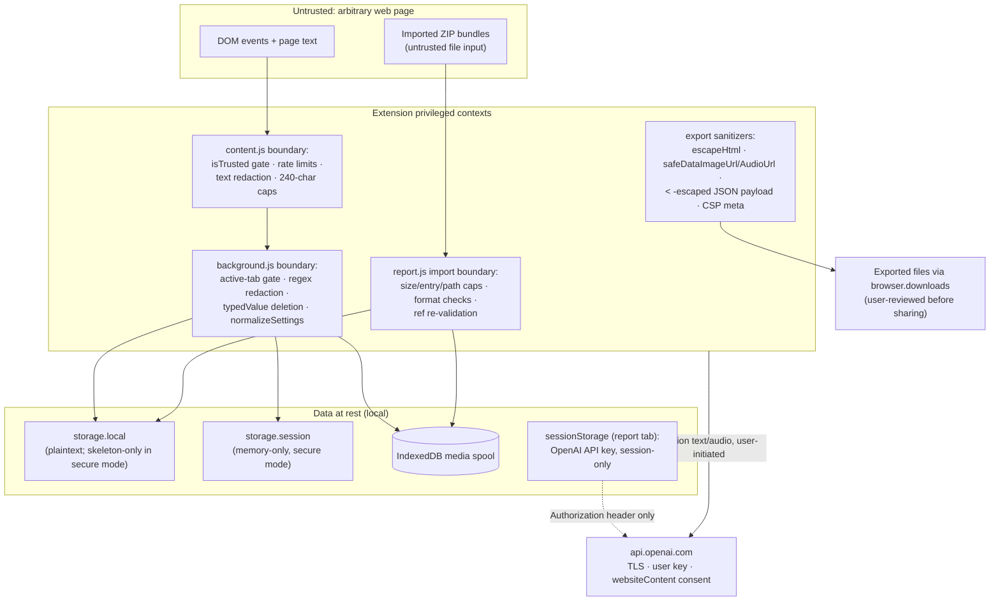

# UI Workflow Recorder Pro — Design

One-line summary: Architecture reference for the Firefox MV2 extension that records UI workflows (steps, screenshots, high-speed GIF bursts) into locally stored, editable, exportable HTML/ZIP reports.

## Context

- Firefox WebExtension, manifest v2, persistent background page (`manifest.json:21-27`). No build step; plain JS files loaded directly.
- Records user interactions (click/input/change/submit/nav/ui-change) with human-readable step titles, optional screenshots, and optional high-speed "GIF burst" frame capture.
- All capture data is local-first: `browser.storage.local`/`browser.storage.session` for event/report state, IndexedDB (`uir-frame-spool-v1`) for heavy media (frames, section text, narration audio).
- Only network egress: optional, user-initiated OpenAI STT/TTS from the report builder, triple-gated (session-only API key, Firefox `websiteContent` data-collection consent, hard size caps).
- Constraints: no external runtime assets (air-gap safe), no telemetry, minimal permission surface (`http/https` host permissions only; no `<all_urls>`, no `web_accessible_resources`, no `match_about_blank`).
- A security remediation pass (see `security_audit_report.html`, 2026-03-12) drove the current design: mic-capture subsystem fully removed, trusted-event gating + rate limits in the content script, session-only API key, secure-at-rest mode, screenshot redaction policy, ZIP import hardening.

## Architecture diagram



## Component breakdown

- **content.js — capture agent.** Injected into every http/https page (all frames, `document_start`). Seven document-level capture-phase listeners (click, input, change, keydown/Enter, submit, mousemove, paste) — the paste tier serves as the capture-time-redaction hook for clipboard secrets, inspecting the pasted string against the same redaction rule shapes as typed input and swapping the serialized value for `[REDACTED CLIPBOARD]` before the event enters the RECORD_EVENT stream (the page's own clipboard is not touched). Plus SPA nav detection via a top-frame 1100 ms URL poll (content.js:394; the `pushState`/`replaceState` wrappers are Xray-invisible to page scripts and remain only as a no-op belt — the poll is the real mechanism) and a top-frame MutationObserver ("page watch") for `ui-change`/`scroll` steps. bfcache-resilient: teardown runs only on a real `pagehide` (`!ev.persisted`, no `beforeunload` handler), and `pageshow` with `persisted` re-runs page-watch setup. Every listener is fronted by `isTrustedUserEvent` (rejects `isTrusted !== true`) and `consumeEventRateBudget` (fixed-window per-event-type rate limits, `EVENT_RATE_LIMITS` content.js:36-45). Generates step titles from labels/aria/text heuristics, applies two-layer redaction (text substitution to `[REDACTED]` + sensitive-field viewport rects), and streams throttled cursor samples during burst mode. Stateless: pulls all state from background via `GET_STATE`.
- **background.js — recorder core.** Three-state machine (idle/recording/paused) with all lifecycle transitions serialized through a promise-chained `lifecycleQueue`. Ingests `RECORD_EVENT`s: gates (recording state, capture mode, active-tab-only), redacts (regex rules background.js:36-47), attaches debounced/diff-deduped screenshots (`tabs.captureVisibleTab`), persists coalesced (min 1.5 s between writes, trailing flush, cancelled on stop — `persistRecordEventCoalesced`). Runs the burst capture loop (below), the two-phase stop (immediate detach + queued finalization job: queued → draining (awaits spool idle up to 15 s, records `drainOutcome` drained/timeout) → snapshot → sync-refs → persist → done/error), pending-stop salvage (`__uiRecorderPendingStopSnapshot` written before detach, deleted after a successful persist, recovered on startup as a "(recovered)" report), report snapshot with retention of latest 3, screenshot compaction, idle auto-pause, hotkey commands, and reactive auto-pause when a granted host permission is revoked during recording (`browser.permissions.onRemoved` — tracks revoked origins; `permissions.onAdded` clears when all revoked origins are re-covered via `permissions.contains()`); the pause reason is exposed on GET_STATE as `pauseLimitationReason` and surfaces in the popup status.
- **frame_spool.js — media spool.** Three-stage bounded pipeline (captureQueue → processQueue/decode → writeQueue → IndexedDB) with per-stage depth and byte caps; queue fullness maps to backpressure levels (healthy/moderate/high/severe) that govern burst FPS (10/8/6/4) and frame dropping. The pump is progress-gated: it reschedules on a microtask only after a stage made forward progress, otherwise retries on a 12 ms timer (`PUMP_STALL_RETRY_MS`, frame_spool.js:25) so microtask spinning cannot starve IndexedDB callbacks under burst load. Shared by background (writes) and report page (reads/writes) as a library, not a service — both open the same IndexedDB. GC deletes unreferenced frames older than 24h and enforces byte budgets (frames 1.5 GB, text 256 MB, audio 512 MB).
- **frame_spool_worker.js — optional decode worker.** Off-thread dataURL→ArrayBuffer decode; disabled in production (`decodeWorkerEnabled:false`), decode runs inline-safe. Three consecutive worker errors permanently fall back to inline for the service lifetime.
- **popup.js/popup.html — control surface.** Stateless controller polling `GET_STATE` every 1200 ms. Exposes 15 settings (capture, privacy incl. screenshot redaction policy + secure-at-rest, idle, GIF FPS) via `UPDATE_SETTINGS`; renders recording status, stop-finalization phase, burst perf counters, and spool runtime diagnostics. Stop uses a dual channel: runtime message + a `__uiRecorderStopRequestTs` storage token with monotonic/stale-token guards.
- **report.js/report.html — report builder.** Loads the `reports` array, derives burst pseudo-sections from consecutive burst events, renders editable step cards (titles, 200-char subsection descriptions, annotations, section text panels with dual-provider narration), and produces three exports: standalone HTML (fully self-contained, all assets as data: URLs, one inline script), raw ZIP bundle v4 (Store-only, round-trip editable), and section-media ZIP (stills + in-page-encoded GIFs). Import enforces layered caps (2 GiB archive, 60,000 entries, 512 MiB/entry, Store-only, path-traversal/duplicate/NUL rejection, format/version validation) plus magic-byte sniffing of restored frame and audio bytes (`sniffImportedAudioMime`). Saves merge by report id with the stored array and stamp a `reportsMeta` writer marker (`writer:"report"`; background stamps `writer:"background"` and ignores its own echoes), so a live recording and an open report tab cannot clobber each other. No runtime messaging with background — shared state via storage + IndexedDB only.
- **docs.html — in-app documentation.** Static page opened from the popup; documents install, quick start, configuration templates, hotkeys, export/import, STT flow, privacy.

## Data & trust boundaries



- **Classification.** Captured events and screenshots may contain sensitive business/auth content. Text redaction is on by default (keyword + regex, both content- and background-side); screenshot pixels are only protected by policy (`screenshotRedactionMode: omit`) or secure-at-rest mode — pixel-level masking of captured screenshots is not automatic.
- **Trust model.** Web pages are untrusted: synthetic events are rejected (`isTrusted`), event floods are rate-limited, all captured text is length-capped and redacted before leaving the page, and background re-checks sender/tab identity on every message. Imported ZIPs are untrusted: parsed by a Store-only parser with hard caps before any content is honored. Exported HTML is rendered in third-party browsers: every interpolated value passes `escapeHtml`/data-URL regex validation; the embedded burst JSON escapes `<`; a restrictive CSP `<meta>` (`default-src 'none'`, inline script/style only, `img/media-src data:`, report.js:4773) backstops the sanitizers, and the in-builder quick preview renders in a `sandbox="allow-scripts"` iframe (report.html:358).
- **Secrets.** The OpenAI API key lives only in report-tab `sessionStorage` (cleared on tab close); the legacy `localStorage` copy is migrated and deleted. The key is never written to `browser.storage`, exports, or logs.
- **Encryption at rest.** None at the extension layer — relies on OS full-disk encryption. Secure-at-rest mode is the compensating control: routes state to memory-only `storage.session` and suppresses screenshot capture entirely. Decision (resolves former open question): enabling the mode purges retroactively — screenshot pixels/refs are stripped from in-memory events and all reports, the sanitized state is persisted, and unreferenced spool media is GC'd immediately (`orphanMaxAgeMs: 0`, `purgeFrameSpoolForSecureAtRest`). Destructive to screenshots in existing reports; export first.
- **Egress.** Exactly two endpoints, both `api.openai.com` over TLS, both requiring explicit user action + API key + Firefox `websiteContent` consent. Core features perform zero network calls.

## Code snippets

Screenshot pixel policy — single predicate consulted by every capture path (background.js):

```js
function shouldCaptureScreenshotPixels(effSettings) {
  const s = effSettings || settings;
  if (s.secureAtRestMode) return false;
  if (normalizeScreenshotRedactionMode(s.screenshotRedactionMode) === "omit") return false;
  return true;
}
```

Trusted-event gate — first check in every content-script listener (content.js):

```js
function isTrustedUserEvent(ev) {
  return !!(ev && ev.isTrusted === true);
}
```

Secure-at-rest persistence routing (background.js, abridged):

```js
if (secure && browser.storage.session) {
  await browser.storage.session.set(fullState);
  await browser.storage.local.set(skeleton);   // settings only; events/reports []
} else if (secure) {
  await browser.storage.local.set(skeleton);   // settings only; events/reports stay memory-only
} else {
  await browser.storage.local.set(fullState);
}
```

## Sequence of work (remediation completion)

1. ~~Jobs 1–6 core implementation~~ — in working tree (mic removal, session-only key, secure-at-rest + redaction policy, trusted events, permission minimization, import caps).
2. ~~Close residual gaps from the remediation audit: legacy mic-diag storage purge, eager legacy-key purge, no key echo in the key prompt, import MIME/byte-cap enforcement for restored assets, secure-mode gating of section text/audio persistence, scroll-handler trust check, merge-import state safety.~~
3. ~~Update all user-facing documentation (README, docs.html, PRIVACY, AMO template, CHANGELOG, manifest description) to match remediated behavior.~~
4. ~~Stability hardening pass: progress-gated spool pump with stall-timer retry, reports writer-marker + merge-by-id race fix, persist-before-GC ordering in report snapshots, coalesced RECORD_EVENT persistence, stop-finalization spool drain wait, pending-stop crash salvage, secure-at-rest purge-on-enable.~~
5. Operational test per `docs/OPERATIONAL_TEST.md`; then release per `docs/AMO_SUBMISSION.md`.

## Risks & mitigations

| Risk | Impact | Likelihood | Mitigation |
|---|---|---|---|
| Screenshot pixels capture sensitive data despite text redaction | High | Medium | `screenshotRedactionMode: omit`, secure-at-rest mode, annotation obfuscate tool, user review before sharing exports |
| Burst capture overwhelms memory/disk on slow machines | Medium | Medium | Backpressure tiers govern FPS (10/8/6/4), per-stage byte caps, newest-frame drop under severe pressure, stability mode caps FPS at 10 and JPEG q75 |
| storage.local quota exhaustion from inline screenshots | Medium | Low | Spool refs instead of inline frames; screenshot compaction (220→160 normal, 480→360 burst, also on burst inline-fallback); coalesced event persistence (min 1.5 s); 3-report retention |
| Malicious ZIP import (bombs, traversal, spoofed assets) | Medium | Low | Store-only parser, 2 GiB/60,000-entry/512 MiB-entry caps, path/duplicate/NUL rejection, ref re-validation, MIME allow-lists + magic-byte sniffing (frames and audio) |
| Stored XSS in exported HTML opened by third parties | High | Low | `escapeHtml` on all interpolation, data-URL regex validation, `<`-escaped embedded JSON, restrictive CSP meta in exported HTML, sandboxed quick-preview iframe |
| Secure-at-rest silently degrades on Firefox without `storage.session` | Low | Low | Skeleton-local fallback (settings only; events/reports memory-only); behavior documented in popup hint and OPERATIONS doc |
| iframe redaction rects use wrong coordinates (`frameOffsetKnown` hardcoded) | Medium | Medium | Known limitation; text redaction still applies; documented — fix requires frame-offset plumbing |
| API key exposure | High | Low | Session-only storage, never persisted/exported/logged; user can clear via key prompt |

## Alternatives considered

- **MV3 service worker** vs persistent MV2 background page: MV2 retained — the burst loop, in-memory event list, and spool pumps need a long-lived context; Firefox MV3 worker lifetime would force a re-architecture (state externalization, alarm-driven loops) for no user-visible gain.
- **Compressed (Deflate) ZIP bundles** vs Store-only: Store-only retained — hand-rolled writer/parser stays ~200 lines, avoids a compression dependency, makes size caps exact (compressed == uncompressed), and screenshots/JPEG/MP3 payloads are already compressed.
- **Encrypting data at rest in-extension** vs OS-level FDE + secure-at-rest mode: rejected — a key stored beside the data adds no real protection; a user-passphrase flow adds UX weight; memory-only `storage.session` + capture suppression gives a stronger guarantee for the sensitive-workflow case.
- **Removing OpenAI integration** for a zero-egress build: rejected — narration/STT are opt-in, triple-gated, and baked audio keeps exported reports key-free; removal would delete a core authoring feature.
- **Worker-pool decode fan-out** for burst frames: shipped but disabled after fan-out lockups on large data-URL payloads; inline-safe cooperative decode is the default, worker path kept behind a flag with error-threshold fallback.

## Open questions

- Should report retention (hardcoded 3, background.js:1858-1860) become a setting?
- iframe redaction-rect coordinates (`collectSensitiveRectsWithFrame` hardcodes top-frame context): fix or document-only? Currently document-only.

## Out of scope

- Chrome/MV3 port, AMO listing content, localization.
- Pixel-level automatic screenshot redaction (OCR/vision-based masking).
- Multi-profile/system-wide storage encryption (delegated to OS FDE per workstation baseline).
- The `dist/` XPI build pipeline and signing flow.

Updated 2026-07-14: content.js nav URL poll + bfcache resilience, background persist coalescing/drain wait/stop salvage, spool progress-gated pump, report import caps + writer-marker merge saves, exported-HTML CSP + sandboxed preview, secure-at-rest purge-on-enable decision recorded (open question resolved), risks table and sequence-of-work refreshed.

Updated 2026-07-14: Tier-1 — seventh capture-phase listener (paste) with `[REDACTED CLIPBOARD]` interception, `EVENT_RATE_LIMITS` citation extended to content.js:36-45, background reactive host-permission-revoked auto-pause with `pauseLimitationReason` surfaced on GET_STATE.
