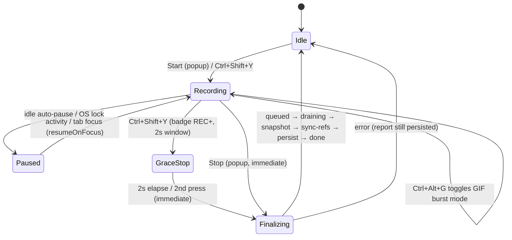

# UI Workflow Recorder Pro — Operations Runbook

One-line summary: How to install, operate, monitor, and troubleshoot the recorder day-to-day, including secure-capture procedures and storage management.

## Context

- Audience: the person running recordings and producing reports, and the maintainer diagnosing issues.
- Companion docs: [DESIGN.md](DESIGN.md) (architecture), [TUNING.md](TUNING.md) (knobs), [OPERATIONAL_TEST.md](OPERATIONAL_TEST.md) (acceptance test), [AMO_SUBMISSION.md](AMO_SUBMISSION.md) (release).
- The extension is local-first: no account, no server, no telemetry. Optional OpenAI STT/TTS is the only network path and is user-initiated per action.

## Recording lifecycle

## Install & load

1. Firefox → `about:debugging#/runtime/this-firefox` → **Load Temporary Add-on…** → select `manifest.json`.
2. Verify the toolbar icon appears and the popup header shows the manifest version.
3. Permanent install: use a signed XPI from `dist/` (see AMO_SUBMISSION.md for packaging).
4. Hotkeys `Ctrl+Shift+Y` (record) and `Ctrl+Alt+G` / `Cmd+Opt+G` (GIF burst) can be rebound at `about:addons` → gear → Manage Extension Shortcuts.

## Standard recording procedure

1. Open the popup, review settings (see configuration templates in `docs.html` / README).
2. **Start** (or `Ctrl+Shift+Y`). Badge shows `REC`; a start lifecycle screenshot step is captured.
3. Perform the workflow. Steps appear in the popup counter. Add context anytime with **Note**.
4. For high-speed capture of an animation/drag interaction: press `Ctrl+Alt+G` to enter GIF burst mode (badge unchanged, popup chip shows `GIF: ON (N FPS)`), perform the interaction, press `Ctrl+Alt+G` again to close the burst. Burst mode forces capture-mode "all" and suspends page watch while active.
5. **Stop** (popup = immediate) or `Ctrl+Shift+Y` (2 s grace so tail burst frames land; second press = immediate). Control returns instantly; finalization runs in the background — the popup shows `Finalizing… (phase)` until done.
6. **Open report** → edit → export. The recorder keeps the **3 most recent reports**; older ones roll off automatically on each stop/save.

## Sensitive-workflow procedure

For auth flows, secrets handling, or anything governed:

1. Popup → Privacy & Stability:
   - `Redact sensitive text in report`: **On** (default).
   - `Redact usernames on login pages`: **On** (default).
   - `Screenshot redaction policy`: **Omit all screenshots** — text redaction never touches pixels, so omit pixels entirely when in doubt.
   - `Secure-at-rest mode`: **On** for session-only storage — events/reports live in `browser.storage.session` (memory, cleared when the browser closes) and all screenshot capture is suppressed.
2. Record as normal. The GIF burst loop will refuse to run (popup loop reason: `secure mode` / `redaction policy`) — expected.
3. Export before closing the browser if you need to keep the report (secure-mode reports do not survive browser exit).
4. Review every export for residual sensitive content before sharing. Redaction inserts the literal `[REDACTED]`; verify it covered your fields.

Secure-at-rest caveats (by design — know them):

- **Purge-on-enable — destructive.** Enabling the mode strips screenshot pixels/refs from in-memory events and every existing report, persists the sanitized state, then immediately purges unreferenced spool media (GC with no age gate). Screenshots in existing reports are permanently lost — **export anything you need before enabling**. Text steps survive.
- **Old-Firefox fallback.** If `browser.storage.session` is unavailable, only a skeleton (settings, recording flags, empty `events`/`reports`) persists to `storage.local` — no event text lands on disk; events and reports are memory-only and are lost when the background page goes away.
- Section text/audio persistence is blocked while the mode is on (the builder shows a status message instead of saving).

## OpenAI narration / transcription (optional egress)

- Set the API key from a section text panel → **Set API key**. The key lives in the report tab's `sessionStorage` only — cleared when the tab closes, never persisted to disk, never included in exports. Re-enter it per tab/session.
- First use prompts for Firefox's `websiteContent` data-collection consent; without it, no request is sent.
- STT is upload-only (**Transcribe audio file**, ≤24 MB). There is no microphone path in this build.
- Generated cloud narration is baked into the report so exported HTML plays audio without any key.
- Error codes surfaced in the panel: `permission-denied` (consent missing), `oversize-audio`, `api-failure` (check key/quota), `empty-audio`.

## Monitoring & diagnostics (popup)

| Indicator | Healthy | Investigate when |
|---|---|---|
| Status line | `Recording…` / `Finalizing… (persist)` briefly after stop | `Finalizing…` stuck >30 s, or `error` phase — see Troubleshooting |
| GIF chip | `GIF: ON (10 FPS)` during bursts | ON but `Loop: Idle` with a reason — loop is paused (reason tells you why: backpressure, no active tab, secure mode, redaction policy) |
| Burst perf | fail=0, low dropped, effective FPS ≈ target | rising `Dropped` / `Backpressure pauses`, effective FPS pinned at 4 — see TUNING recipes |
| Spool runtime | pressure `healthy`, safety cap `off` | pressure `high`/`severe` sustained, safety cap `on`, `droppedFrames` climbing |
| Stop finalization | `done` | `error:` prefix — the report was still persisted; capture the message |

Console diagnostics: `about:debugging` → Inspect the extension → background console. `bgWarn` messages always print; set `DEBUG_LOGS=true` (background.js:110) for verbose tracing. `GET_STATE` from any extension console returns the full state snapshot including `stopFinalization`, `burstPerf`, and `spoolRuntime`.

## Storage management

| Store | Contents | Bound | Reclaim |
|---|---|---|---|
| `storage.local` | settings, events (inline shots until compaction), reports ×3, transient pending-stop salvage snapshot (`__uiRecorderPendingStopSnapshot`, session area in secure mode) | compaction 220→160 inline shots; 3-report retention | delete reports in builder; salvage key auto-removed after persist |
| `storage.session` | full state when secure-at-rest is on | browser session | closes with browser |
| IndexedDB `uir-frame-spool-v1` | burst frames, section text, narration audio | 1.5 GB frames / 256 MB text / 512 MB audio, orphan age 24 h | automatic GC after report changes; manual: delete reports, wait for GC, or clear extension storage |
| Report-tab `sessionStorage` | OpenAI API key | tab lifetime | close tab or Set API key → empty |

Rough sizing: a 1080p JPEG q75 burst frame is 150–400 KB → a 60 s burst at 10 FPS ≈ 90–240 MB of spool. Exported HTML embeds burst frames twice (slides + player payload); expect large files for burst-heavy reports.

## Export / import operations

- **HTML bundle**: single self-contained file (carousel viewer + Workflow Queue). Safe to share after review; no external requests, narration embedded.
- **Raw ZIP (bundle v4)**: lossless round-trip for re-editing/merging. Import caps: 2 GiB archive, 60,000 entries, 512 MiB/entry, Store-only. Bundles v1–v4 import; skipped-entry counts are surfaced in the import status.
- **Section media ZIP**: read-only stills + animated GIFs.
- Import modes: **New report** (unshifts; trims to the 3 most recent at import time with a visible notice) or **Merge into current**.
- Print to PDF: popup → **Print to PDF** (opens `report.html?print=1`).

## Troubleshooting

| Symptom | Likely cause | Action |
|---|---|---|
| No steps recorded on a page | Page is not http/https (file:, about:, extension pages are unsupported by design); or events are synthetic | Use an http(s) page; drive interactions with real input — `isTrusted` gating drops scripted events |
| Steps recorded but no screenshots | Redaction policy `omit`, secure-at-rest on, or diff dedupe | Check Privacy settings; `screenshotSkipReason` on the event says why (`redaction-policy`, `secure-at-rest`, `unchanged`, `compacted-memory`, `gif-loop-owned`) |
| GIF hotkey does nothing | Not recording (burst toggle is ignored when idle) | Start recording first |
| Burst loop paused | Backpressure, no injectable active tab, or a privacy policy | Popup loop reason chip; if backpressure, see TUNING recipes |
| Stop appears stuck in `Finalizing` | Draining waits for the spool to go idle (up to 15 s) before snapshot | Non-blocking by design; the phase records `drainOutcome` drained/timeout, then snapshots and persists either way; if `error`, inspect background console |
| Report shows "frame unavailable" | Spool GC removed orphans, or report opened before a drain timeout finished flushing | Rare now that stop drains up to 15 s; reopen the report (refs retry); avoid deleting reports mid-edit |
| Browser/extension crashed during finalization | Pending-stop snapshot was written before detach | On next startup the session is salvaged as a report titled with "(recovered)"; in secure mode without session storage, salvage is skipped by design |
| SPA route change takes ~1–2 s to appear as a nav step | Nav URL poll cadence (1100 ms, top frame) | Expected; history-API wrappers are not visible to page scripts, the poll is the capture mechanism |
| Import rejected | Cap exceeded / compressed ZIP / bad bundle | Only Store-mode bundles produced by this extension import; check caps in TUNING §6 |
| Narration fails | Key/consent/size | Panel error code; re-enter key (session-only), grant consent, respect 24 MB / 12k-char caps |
| Popup `Add note` prompt doesn't open | Some Firefox builds suppress `window.prompt` in popups | Edit titles/descriptions in the report builder instead |
| Recording survives browser restart oddly | By design: restored `isRecording` restarts the clock; pre-restart stop tokens are treated stale | Stop via popup |

## Data & trust boundaries (operational view)

- Treat every recording as potentially sensitive until reviewed. Exports are the exfiltration surface — review before sharing; nothing leaves the machine otherwise.
- The workstation baseline (full-disk encryption, screen lock) is the at-rest control for `storage.local` and IndexedDB; secure-at-rest mode is the in-extension control for regulated captures.
- Never paste API keys anywhere except the Set API key prompt; the key is scoped to that tab session.

## Release / publish

Follow `docs/AMO_SUBMISSION.md`: version bump, README/docs.html/CHANGELOG sync, `node --check` on all five JS files, `npx --yes web-ext lint --source-dir .` (expect 0/0/0), package XPI + source ZIP into `dist/`.

Updated 2026-07-14: secure-at-rest caveats rewritten for purge-on-enable + skeleton fallback, import caps/modes updated (2 GiB, trim-at-import), troubleshooting rows for drain wait, crash salvage, and SPA nav poll, DEBUG_LOGS line ref fixed, salvage key added to storage table.
