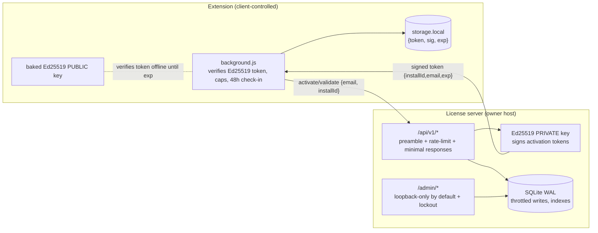

# License system hardening — throughput, tamper-resistance, server lockdown

One-line summary: harden the v1.23.0 license system to sustain ~500 req/s, make the browser-side license state unforgeable by data-file edits (Ed25519-signed activation tokens), and lock the server's takeover and data-exfiltration surfaces.

## Context

- The license server holds the business together: it is authoritative on who is licensed and how many seats are in use. The extension is client software the user fully controls.
- Threats to defend (from the owner):
  1. Spoofing the activate/validate message workflow to backdoor the server, create licenses, or read other users' data.
  2. A user flipping their own local license state from free to active by editing a file.
  3. Load: ~500 requests/second so a fast, popular launch stays stable.
- Honest threat-model boundary: the extension is AGPL and unminified. A user who edits the extension's own code can disable any client-side check. No client-side scheme prevents that. What we CAN prevent: forging license state by editing stored data (signed tokens), and any server-side compromise or cross-user data theft. The seat count enforced server-side is the real revenue protection.

## Architecture (hardened)

## Component breakdown

- **Ed25519-signed activation token.** On a successful activate/validate the server returns `{token, sig}` where `token = base64url({v,installId,email,exp})` and `sig = Ed25519(private, token)`. The extension bakes the matching PUBLIC key and marks itself licensed only when the signature verifies, `exp` is in the future, and `installId`/`email` match this install. Editing `storage.local` to set `status:"active"` no longer works — a valid signature cannot be produced without the server's private key. `exp` (7 days) bounds offline validity; the 48 h check-in refreshes it. A revoked/unknown validate demotes immediately; a network failure keeps the token until it expires.
- **Generational nonce cache** (preamble.mjs): replaces the single fixed-size Map that refused traffic once full. Two rotating maps keyed by nonce, rotated every half-window; a nonce is "seen" if in either. Bounded memory, O(1), never refuses a legitimate request. Window shortened to the 5-minute preamble skew (older nonces can't be replayed anyway).
- **Write throttling** (db.mjs): `validate` updates `last_seen_at` at most once per hour per activation instead of on every check-in, removing the dominant write at 500 req/s.
- **Admin lockdown** (server.mjs): admin routes are served only to loopback (and an optional `LICENSE_ADMIN_ALLOW_IPS` allowlist) unless `LICENSE_ADMIN_PUBLIC=1`; the owner reaches them over an SSH tunnel or a reverse proxy. Login adds per-IP exponential lockout on top of the rate limit. Sessions stay per-process; admin is single-owner and low-traffic.
- **Response minimization** (server.mjs/db.mjs): API responses expose only `{ok,status,token,sig,validateEveryHours}` — no seat counts, active-seat counts, or demotion flags — so an attacker who extracted the public preamble key learns nothing about the customer base beyond a per-email licensed/not oracle (rate-limited).
- **HMAC rotation** (preamble.mjs/server.mjs): the server accepts a current and an optional previous client HMAC so the preamble key can be rotated with a staged extension release without downtime.
- **Scale**: a single Node process with synchronous, indexed SQLite (WAL, throttled writes) is load-tested to confirm ≥500 req/s of validate on one host. The Postgres migration path is documented for growth beyond a single host.

## Data & trust boundaries

- The preamble HMAC ships in a public extension, so it is a scanner/abuse deterrent, not authentication. The real boundaries: (a) license creation only via the password-protected, loopback-bound admin UI or the local CLI — no API path creates a license; (b) validate/deactivate require the 64-hex random `activationId` bound to the install, so one user cannot touch another's activation; (c) admin is not internet-reachable by default.
- Server holds the Ed25519 PRIVATE key and the admin password hash (scrypt). Client holds only the PUBLIC key and its own signed token.
- No eval/deserialization/shell; parameterized SQLite; container runs non-root, read-only root FS, dropped capabilities.

## Sequence of work

1. preamble.mjs: generational nonce cache; multi-HMAC verify. 2. db.mjs: last_seen throttle; token signing helper; minimal activate/validate results. 3. server.mjs: signed-token issuance; response minimization; admin loopback-bind + allowlist + login lockout; multi-HMAC config; signing-key config. 4. cli.mjs: `gen-signing-key`. 5. background.js: bake public key; verify token; token-expiry demotion; store token+sig. 6. popup.html: remove the workflow-disclosure text. 7. tests + load test. 8. docs + SBOM.

## Risks & mitigations

| Risk | Impact | Likelihood | Mitigation |
|---|---|---|---|
| User edits extension code to bypass caps | One user runs free | High | Unpreventable client-side; server seat enforcement protects revenue; AGPL |
| Preamble key extracted, API abused | Email enumeration, request floods | Medium | Rate limit + minimal responses + no license-creation API; rotate key on abuse |
| Admin UI exposed | License creation / data theft | Medium→Low | Loopback-only by default + password + lockout + CSRF + non-root container |
| Nonce cache refuses under load | Legit requests dropped | Was High | Generational cache never refuses; bounded memory |
| SQLite write pressure at 500 rps | Latency spikes | Medium | last_seen throttle; WAL; indexes; load-tested |
| Token replay after revoke | Up to 7 days of access | Low | Revoke demotes on next check-in; shorten `exp` if needed |

## Alternatives considered

- Per-request server signatures (asymmetric) instead of a shared HMAC preamble: does not help — the client must hold some credential; the signed activation token plus server authority is the effective control.
- Clustered workers for throughput: rejected for now — it splits the nonce-replay set and admin sessions across processes (needs a shared store), and a single process meets 500 req/s. Documented as the scale-out step (shared nonce/session store or Postgres).
- Encrypting the local license blob: rejected — a symmetric key in the client is extractable; a signature the client only verifies is the correct primitive.

## Open questions

- Production `exp` / check-in cadence (default 7-day token, 48 h refresh).
- Whether to add TOTP to the admin login (out of scope now; loopback-bind covers most of the risk).

## Out of scope

- Payment processing; horizontal scale-out / Postgres; per-feature license tiers.

Updated 2026-09-03: initial hardening design.
