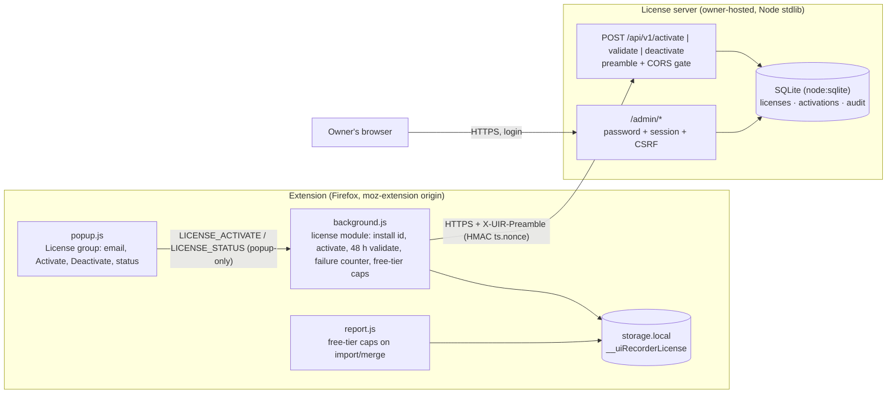
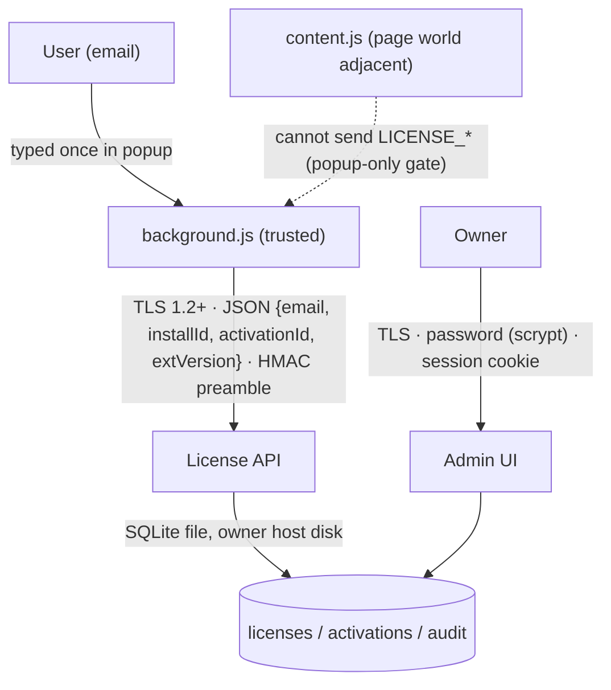

# Licensing system — free tier caps, email-based activation, seat enforcement, self-hosted license server

One-line summary: the extension stays fully local until a user activates by email; activation and a 48-hour check-in talk over TLS to a stdlib-only Node license server the owner hosts, which enforces purchased seats by demoting the oldest device.

## Context

- Problem: monetize the recorder without issuing keys. Free installs are capped (GIF bursts ≤ 5 s and ≤ 3 per report, ≤ 10 screenshots per report); a purchase is recorded server-side by email; the extension activates by asking the server whether the email is licensed.
- Constraints (from the owner): no keys handed to users; TLS in transit; seats enforced server-side (6th device on a 5-seat license demotes the 1st); the extension re-validates every 48 h and drops to free after 10 consecutive failures; free installs never call home; the server accepts only requests that announce themselves as the real extension; the server needs a simple admin UI and is run in a container or on a Linux host.
- Assumptions: the extension stays AGPL and unminified, so any secret inside it is discoverable. The request preamble therefore deters scanners and casual abuse; the seat rule and revocation are what actually enforce licensing. Node ≥ 24 on the server (built-in `node:sqlite`).
- Placement: `license-server/` in this repository (owner's choice), excluded from the AMO package by `web-ext-config.mjs`.

## Architecture



## Component breakdown

- **background.js license module**: generates a per-install UUID once; holds `{ status: free|active, email, activationId, installId, activatedAt, lastValidatedAt, failures }` in `storage.local` key `__uiRecorderLicense`; `activate(email)` and `deactivate()` on popup request; a scheduler runs `validate()` every 48 h (and at startup when overdue) only while `status === active`; a network or server error increments `failures`, success resets it, `failures ≥ 10` or a `revoked` answer demotes to free. Free-tier caps: `isLicensed()` gates (a) a 4th GIF burst per session (refused with pause reason `free-tier-bursts`), (b) burst auto-stop at 5 s (`free-tier-burst-time`), (c) screenshots beyond 10 per report (skipped with reason `free-tier-screenshots`).
- **popup.js License group**: shows tier, email, last check, failures; email input + Activate; Deactivate; the free-tier counters (screenshots and bursts used) so the cap is never a surprise.
- **report.js caps**: `applyFreeTierCaps(report)` on import and merge (bursts beyond 3 dropped, screenshots beyond 10 removed) when the stored license is free. Reports captured while licensed are left intact if the install is later demoted.
- **license-server/server.mjs**: HTTPS (TLS ≥ 1.2) or HTTP behind a TLS proxy; API gate = extension `Origin`, `X-UIR-Client` prefix, body ≤ 4 KB, preamble HMAC with ±5 min skew and 10 min nonce replay window, 60 req/min/IP; failures answer an empty 404. Admin = scrypt password, 12 h session cookie (HttpOnly, SameSite=Strict, Secure), per-session CSRF, 5 logins/min/IP, CSP without scripts, system fonts, no external assets.
- **license-server/db.mjs**: `licenses(email UNIQUE NOCASE, seats)`, `activations(install_id, activation_id, status, timestamps, revoke_reason)`, `audit`. `activate` is idempotent per install; `enforceSeats` revokes the oldest active activation while `active > seats` (also when seats are lowered).
- **license-server/cli.mjs**: `gen-secret`, `hash-password` (stdin or env, never argv), `add-license`, `list`.
- **Deploy**: Dockerfile (non-root, read-only FS, dropped capabilities), `compose.yaml`, systemd unit with hardening, `.env.example`.

## Data & trust boundaries



- Classification: email and install UUID are PII-adjacent; they are stored in `storage.local` on the client and in the server DB; server logs carry only a hash prefix of the email and an 8-char install prefix. No page content, screenshots, or report data ever reach the server.
- Encryption in transit: HTTPS only from the extension (the origin constant must be `https://`; a loopback `http://127.0.0.1` override exists solely for the local harness). Server: `minVersion: TLSv1.2`, HSTS when TLS terminates locally.
- At rest: server SQLite on an owner-controlled disk (use disk encryption); admin password stored as scrypt hash; activation ids are 32 random bytes and act as bearer tokens for validate/deactivate (scoped to email + install id).
- AuthN/AuthZ points: API preamble (client attestation, deterrent), activation id + install id + email (per-device credential), admin password + session + CSRF (owner).
- Egress: the extension contacts exactly one origin, only when licensed or during a user-initiated activation.

## Code snippets

```js
// background.js — request preamble (WebCrypto HMAC-SHA256 over v1.ts.nonce.METHOD.path.sha256(body))
async function licensePreamble(path, body) {
  const ts = String(Date.now());
  const nonce = hex(crypto.getRandomValues(new Uint8Array(16)));
  const key = await crypto.subtle.importKey("raw", enc(LICENSE_CLIENT_SECRET), { name: "HMAC", hash: "SHA-256" }, false, ["sign"]);
  const mac = hex(new Uint8Array(await crypto.subtle.sign("HMAC", key, enc(`v1.${ts}.${nonce}.POST.${path}.${await sha256Hex(body)}`))));
  return `v1.${ts}.${nonce}.${mac}`;
}
```

```js
// db.mjs — seat rule
while (countActive(licenseId) > license.seats) revokeOldestActive(licenseId, "seat-limit");
```

## Sequence of work

1. Server: `preamble.mjs`, `db.mjs`, `server.mjs`, `cli.mjs`, tests (`node --test`), deploy files, README — done in this change.
2. Extension: license module in `background.js` (state, activation, validation scheduler, caps), popup License group, `report.js` caps on import/merge.
3. Tests: `docs/optest.js` covers cap logic, preamble builder, and the failure-counter state machine with a mocked fetch; `docs/e2e/run.mjs` checks the screenshot cap and burst refusal in free tier.
4. Docs: PRIVACY.md (what is sent, when), docs.html, README, CHANGELOG, DESIGN.md, TUNING.md rows, OPERATIONS.md (running the server), AMO reviewer notes (new remote endpoint), `sbom/license-server.cdx.json`.
5. Owner steps: pick the hostname, generate the client secret, paste it into both the server env and `background.js`, obtain a TLS certificate, deploy, add purchases in the admin UI.

## Risks & mitigations

| Risk | Impact | Likelihood | Mitigation |
|---|---|---|---|
| Client secret extracted from the public extension | Bots can talk to the API | High | Preamble is a deterrent only; seats/revocation are server-side; rate limit; empty 404s; rotate the secret with a release if abused |
| Offline abuse (block the server, keep the license) | Free limits bypassed for ~20 days | Medium | 10 consecutive 48 h failures demote; the popup shows failures so honest users know |
| Seat churn (activate/deactivate loops) | Users share one seat | Medium | Audit log + admin view make it visible; owner can revoke or reduce seats |
| Admin UI exposed on the internet | Credential attacks | Medium | scrypt password, login rate limit, cookie flags, CSP; bind admin behind a VPN or allow-list at the proxy |
| Clock skew on client | Preamble rejected (±5 min) | Low | Popup shows "check your clock" when activation fails with the skew reason |
| DB loss | All licenses gone | Low | Single SQLite file: back it up (documented) |

## Alternatives considered

- Signed license keys emailed to users: rejected by the owner (no keys). Would allow offline validation but breaks seat demotion.
- Public-key signed tokens instead of random activation ids: rejected as unnecessary — the server is authoritative on every check anyway.
- mTLS client certificates as the "real software" signal: not usable from a WebExtension `fetch` without user-visible certificate UI.
- Host permission for the license origin instead of CORS: rejected; CORS keeps the manifest permissions unchanged for AMO.
- External DB/web framework: rejected; stdlib `http` + `node:sqlite` gives zero dependencies, zero SBOM churn.

## Open questions

- Production hostname (placeholder `https://license.example.invalid` until the owner decides).
- Whether purchases arrive by manual admin entry only, or later via a payment-provider webhook (out of scope now).
- Whether a licensed export should be watermark-free while free exports carry a notice (not requested; not done).

## Out of scope

- Payment processing, invoices, refunds.
- Per-feature tiers beyond free/licensed.
- Offline activation or grace tokens.

Updated 2026-09-03: initial design; server implemented first, extension side and docs follow in the same change.

Updated 2026-09-03: implemented — server (license-server/), extension license module + free-tier caps, popup License group, tests (license.mjs 11/11, optest license assertions, server 4/4), docs, and SBOM. Production hostname and client secret remain owner-set before the store build.
