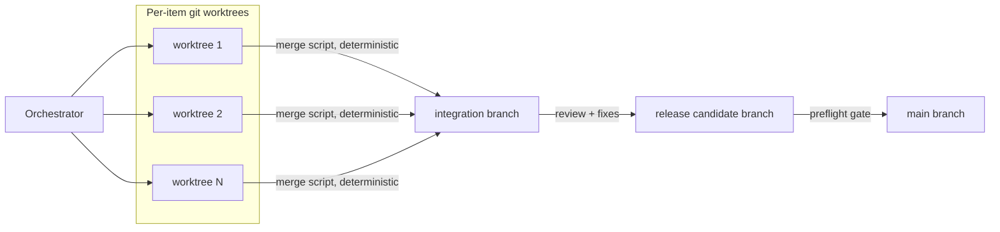

# Tier 1 + Tier 2 Enhancement Build — Multi-Agent Workflow Plan

One-line summary: Sequenced multi-agent workflow to build the 5 Tier-1 items and the ~28 Tier-2 items surfaced by the 2026-07-14 brainstorm pass, with per-item cross-checks and an adversarially-verified security + code review gating each tier.

## Context

- Source of Tier-1/Tier-2 items: brainstorm pass, `docs/plans/../..` — full results in workflow run `wf_2181aa61-87d` (58 raw ideas synthesized).
- Base state: `main` at commit `3a75411` (v1.17.0 remediation release), fully pushed, XPI packaged, preflight green.
- Non-goals held across all tiers: no telemetry, no external asset loading at runtime, no cloud lock-in, no MV3 port, no new persistent runtime deps without pre-selection review, no pixel-OCR redaction.
- Preflight gate for every commit: `node --check` on all six JS files + `docs/optest.js` (currently 60 assertions, extended in Tier 2) + `web-ext lint` 0/0/0 + `gitleaks git` clean.
- Concurrent-session hazard (noted in memory): another Claude session may edit this tree; the workflow uses git branches per phase to bound blast radius, and every phase re-verifies preconditions before writing.

## Architecture diagram — workflow shape

```mermaid
flowchart TD
  subgraph T1[Tier 1 pipeline]
    T1A[Phase A: baseline scan<br/>1 agent] --> T1B[Phase B: design sketches<br/>5 agents parallel]
    T1B --> T1C[Phase C: build in worktrees<br/>5 agents parallel, isolation:worktree]
    T1C --> T1D[Phase D: per-item verify<br/>5 agents parallel]
    T1D --> T1E[Phase E: merge worktrees<br/>deterministic]
    T1E --> T1F[Phase F: cross-check<br/>1 agent]
    T1F --> T1G[Phase G: multi-perspective review<br/>5 lens agents parallel]
    T1G --> T1H[Phase H: adversarially verify findings<br/>pipeline]
    T1H --> T1I[Phase I: apply confirmed fixes<br/>1 agent]
    T1I --> T1J[Phase J: preflight + XPI + push<br/>1 agent]
  end

  T1J --> T2A

  subgraph T2[Tier 2 pipeline]
    T2A[Phase A: baseline + dep graph<br/>1 agent] --> T2B[Batch 2A: foundational<br/>4 items serial]
    T2B --> T2C[Batch 2B: independent parallel<br/>~15 items in worktrees]
    T2C --> T2D[Batch 2C: security cluster<br/>7 items serial with mini-review each]
    T2D --> T2E[Batch 2D: large refactors<br/>3 items worktree]
    T2E --> T2F[Merge all worktrees]
    T2F --> T2G[Cross-check + regression sweep<br/>1 agent]
    T2G --> T2H[Multi-perspective review<br/>5 lens agents parallel]
    T2H --> T2I[Adversarial verify]
    T2I --> T2J[Apply fixes]
    T2J --> T2K[Preflight + XPI + push]
  end
```



## Component breakdown

- **Phase A — baseline scan.** One read-only agent re-checks each planned item against the current tree (in case something changed since the brainstorm), records file:line anchors, and confirms non-goal fence. Aborts a stale item rather than building the wrong thing.
- **Phase B — design sketches.** Per-item design agents. Each produces: files to touch, function signatures to add/change, tests to add to `docs/optest.js`, an explicit "what could break" list. Small structured schema; used by the build phase to stay tight.
- **Phase C — build.** Per-item build agents in **git worktrees** (`isolation: 'worktree'`). Each agent's writes are confined to its worktree so parallel builds cannot collide on the same file. Constraint: no cross-item edits inside a single agent.
- **Phase D — per-item verify.** For each built item: `node --check` on touched files, run `docs/optest.js`, run any new item-specific assertions the design phase specified. Fail-fast — a red item blocks its own merge, not the batch.
- **Phase E — merge worktrees.** Deterministic script (not an agent) that cherry-picks each verified worktree branch onto the integration branch in a chosen order, handling any textual conflicts with a documented resolution table.
- **Phase F — cross-check.** One agent runs the full harness against the merged tree, plus targeted end-to-end sanity (records a fake session via message injection in the harness, exports, re-imports).
- **Phase G — multi-perspective review.** Five parallel lens agents (correctness, security, perf, a11y, docs-consistency). Each produces findings against a shared schema.
- **Phase H — adversarial verify.** Every finding gets 3 independent refuters (each with a distinct lens: reachability, severity, existing-mitigation). ≥2 refuters must fail to confirm the finding.
- **Phase I — apply fixes.** One agent applies only the confirmed findings; refuted findings are logged and dropped.
- **Phase J — preflight + XPI + push.** Deterministic: syntax + harness + web-ext lint + gitleaks + XPI build + version bump + merge to main + push.
- **Tier 2 batching** (Phase A → K) — same shape, but the build phase is split into four batches because Tier 2 has real dependencies:
  - **Batch 2A (foundational, serial):** schema-versioned settings/reports migration, diagnostics ring, retention setting, runtime DEBUG_LOGS toggle. Later items depend on these.
  - **Batch 2B (independent, parallel worktrees):** recording presets, rename/delete reports, undo stack, coalesced editor saves, storage quota preflight, cross-report search, step tags, report templates, markdown export, published bundle JSON Schema, Playwright emitter, optest.js coverage extension, version-migration fixture, web-ext run + eslint config, extend perf paths.
  - **Batch 2C (security cluster, serial with mini-review after each):** WebCrypto-wrapped OpenAI key, custom redaction rules infrastructure, live redaction tester UI, manual redact-before-export overlay, iframe redaction-rect plumbing, Ed25519-signed exports, encrypted-at-rest vault. Serial because they compose on shared state; mini-review catches drift before it compounds.
  - **Batch 2D (large refactors, worktree):** vector annotation primitives, split `render()` from `updateAux`, precomputed search haystack.

## Data & trust boundaries



- **Isolation.** Every build agent writes only inside its worktree. Cross-file contracts (e.g. writer-marker between background and report) are enforced by naming conventions handed to each agent, not by wall-clock coordination.
- **No secret handling.** Every agent context restates non-goals; no agent ever emits a real credential (test fixtures use inert placeholders per gitleaks allowlist policy).
- **Review agents are read-only.** They call `ReportFindings`-style structured output, never `Edit`/`Write`.

## Code snippets — key contracts

Per-item build agent invocation (illustrative — actual workflow script authored inline via `Workflow` tool):

```js
await agent(prompt, {
  label: `build:${item.key}`,
  phase: 'Tier1Build',
  schema: BUILD_SCHEMA,       // returns { touched: [file:line], summary, tests }
  isolation: 'worktree',      // each item in its own worktree
  effort: 'medium'
})
```

Per-finding adversarial verify (2-of-3 majority to confirm):

```js
const votes = await parallel(['reachability', 'severity', 'existing-mitigation'].map(lens => () =>
  agent(`Adversarially verify via the ${lens} lens: ${finding}. Default refuted=true if uncertain.`,
    { schema: VERDICT_SCHEMA, effort: 'high' })
))
const confirmed = votes.filter(v => v && !v.refuted).length >= 2
```

## Sequence of work

1. **Confirm plan with maintainer** (this document; questions in §Open Questions).
2. **Tier 1 execution:** Phases A → J. Estimated wall clock: 60–90 min for the workflow to finish; final merge/push done inline once findings are green.
3. **Post-Tier-1 gate:** operational test §1 (static preflight + docs/optest.js) must pass. `web-ext lint` 0/0/0. XPI verified. Version bump 1.17.0 → 1.18.0. Push to `origin/main`.
4. **Tier 2 execution:** Phases A → K. Estimated wall clock: 3–5 hours because of Batch 2C sequential mini-reviews and Batch 2D large refactors.
5. **Post-Tier-2 gate:** same preflight + full manual OPERATIONAL_TEST.md rerun expected of the maintainer. Version bump 1.18.0 → 1.19.0. Push.
6. **DESIGN.md sync** after each tier — the two open questions resolve during Tier 2 (retention setting, iframe redaction rects) and get moved out of Open Questions with decision recorded.

## Risks & mitigations

| Risk | Impact | Likelihood | Mitigation |
|---|---|---|---|
| Concurrent-session tree edits mid-workflow | High (silent conflict, wrong build) | Medium | Every phase re-reads `git status` and target files before writing; abort if HEAD moved unexpectedly. |
| A worktree build produces plausibly-correct code with a subtle regression | High (behavior break) | Medium | Per-item verify runs `docs/optest.js` + item-specific assertion added by the design phase; adversarial verify at review time. |
| Merge script hits unresolvable conflict between two worktrees | Medium (blocks integration) | Low | Batch 2A explicitly serial to establish foundations; Batches 2B/2D chosen from items with disjoint file scope. Escalate to maintainer if conflict is non-textual. |
| Batch 2C security cluster items compose incorrectly (e.g. encrypted vault + custom rules) | High (data loss or leak) | Medium | Mini-review after each 2C item; encrypted vault deliberately last in 2C so it can wrap everything else. |
| Adversarial verify has false negatives (misses a real bug) | Medium | Medium | 5 review lenses provide diversity; final maintainer manual test in real Firefox before AMO submission. |
| Token cost spirals | Cost-only | Medium | Structured schemas cap agent output; `effort: 'medium'` default with `high` only for review lenses; total agent count budgeted in the workflow. |
| Storage schema change without migration | High (v1.17 users lose reports) | Medium | Batch 2A ships the schema-versioned migration table first; every subsequent schema change writes a migration step to that table. |
| CLAUDE.md constraint violation (accidental telemetry, external asset, MV3 API use) | High | Low | Every agent prompt restates non-goals; final review has a "non-goal check" lens; gitleaks scan continues on push. |
| gitleaks scanner false positives (as happened during v1.17.0 push) | Medium (blocks push) | Medium | Pre-commit local scan added to the workflow's final step; identifiers avoided in favor of shorter names. |
| Large scope means partial completion | Medium (half-finished features) | Medium | Every item lands in its own commit on the integration branch — if 15/28 land clean, 13 unfinished stay on their own worktree branches and don't taint the merged tree. |

## Alternatives considered

- **Sequential build (one item at a time)** — safest, but 33 items × per-item verify + review is 8–12 hours of wall-clock. Rejected in favor of batched parallelism with worktree isolation.
- **One-shot mega-agent per tier** — cheaper in orchestration overhead but zero blast-radius control; a single bad merge poisons the whole tier. Rejected.
- **Review-once-at-end (both tiers together)** — cheaper in review token cost but delays feedback on Tier 1 defects into Tier 2 scope, exactly what the user's "1 tier per required reviews" directive rules out. Rejected as explicitly requested.
- **Skip Tier 2 refactors (Batch 2D)** — cuts wall-clock and complexity but loses the vector-annotation feature (V5), the perf work, and a large chunk of user-visible improvement. Preserve unless the maintainer explicitly cuts scope in the Open Questions below.
- **Land Tier 2 as a single branch** vs. `remediation/v1.17.0-on-16.5`-style layered commits — layered is easier to review post-hoc and matches project style. Chosen.

## Confirmed defaults (2026-07-14)

Maintainer went with all defaults:
1. **Tier 2 scope**: build all ~28 items (Batches 2A + 2B + 2C + 2D).
2. **Encrypted-at-rest vault**: full build, ship as an opt-in popup setting.
3. **Vector annotation primitives**: design doc + minimal stub only; open a follow-up plan file for full implementation (multi-week is too much for this workflow).
4. **Version bumps**: `1.17.0 → 1.18.0` after Tier 1 review passes; `→ 1.19.0` after Tier 2 review passes.
5. **Push cadence**: push `origin/main` after each tier's review passes and preflight is green.
6. **Review effort**: 5 lens reviewers at `effort: 'high'`.
7. **Adversarial verify majority**: 2-of-3 refuters confirms a finding.
8. **Dependency graph**: none flagged beyond what §Component breakdown already lists.
9. **Rollback**: preserve the integration branch for hand-off + park unresolvable P1 in `CHANGELOG.md` "Known issues" section under the tier's version.
10. **DESIGN.md open questions**: both resolve during Tier 2 as planned (retention setting → Batch 2A; iframe redaction rects → Batch 2C).

## Open questions (post-execution)

None at this time. Both DESIGN.md open questions are scheduled to resolve during Tier 2 execution; any post-execution decisions will be recorded here at that time.

## Out of scope

- MV3 port and any Chrome compatibility work.
- Cloud-hosted / server-side companion pieces of any kind.
- Any feature requiring telemetry, analytics, or a network round-trip beyond the already-consented OpenAI STT/TTS endpoints.
- Pixel-level automatic screenshot redaction (OCR/vision-based).
- Third-party dependency additions without pre-selection vulnerability review; every proposed feature above uses the browser platform or Node stdlib only.
- Real signing infrastructure (only content-level Ed25519 exports are in scope; AMO signing is unchanged).
- The `dist/` XPI build pipeline restructure.
- Anything in Tier 3 or in the Rejected list from the brainstorm — those are recorded but not built by this plan.
