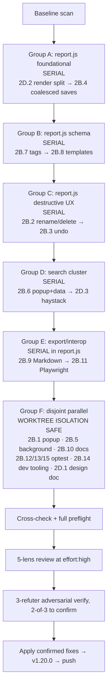

# Tier-2 Batches 2B + 2D Follow-up — Delivery Plan

One-line summary: Re-run the ~18 Tier-2 items that were built into worktrees during the v1.19.0 workflow but couldn't be merged, with the file-collision failure mode eliminated by grouping items serially per shared file and reserving worktree isolation for genuinely disjoint file sets.

## Context

- Original plan: `docs/plans/tier1-and-tier2-enhancement-build-2026-07-14.md`. That plan sized Tier 2 as "~28 items across 4 batches" and shipped 11 (Batches 2A + 2C) as v1.19.0 (`f8951f2`).
- Deferred items were built during workflow run `wf_657e8997-928` using `isolation: 'worktree'`. Each agent's changes landed in a fresh worktree branch; the workflow script had no merge phase, so 18 worktrees stacked up with disjoint copies of overlapping files (mostly `report.js`, `popup.js`, `docs/optest.js`) and could not be merged back into `enhance/tier-2-2026-07-15` without per-item hand-resolution. Worktrees were removed during v1.19.0 cleanup on 2026-07-16 (user request); item deltas are not preserved — this plan re-runs them from the prompts.
- Base: `main` at `f8951f2` (v1.19.0). Preflight is green (227/0, 214 refs / 0 stale, web-ext lint 0/0/0).
- Root cause of the earlier failure: `isolation: 'worktree'` was applied uniformly across 15 items in Batch 2B and 3 items in Batch 2D, but ~11 of them touch `report.js`. Worktrees only pay off when file scopes are disjoint. This plan groups items by primary file and serializes anything sharing a file.
- Non-goals unchanged from the original plan (no telemetry, no MV3, no external runtime assets, no new deps without pre-selection review, no pixel-OCR redaction).

## Deferred items (18 total)

### Batch 2B (~15 items)

| ID | Title | Primary file(s) | Est. |
|---|---|---|---|
| 2B.1 | Recording presets (SPA / Sensitive / Long-session / Default) | popup.html, popup.js | S |
| 2B.2 | Rename + delete individual reports | report.js | S |
| 2B.3 | Undo stack for destructive step edits | report.js | M |
| 2B.4 | Coalesced editor saves (500ms trailing) | report.js | M |
| 2B.5 | Storage quota preflight + backpressure integration | background.js | M |
| 2B.6 | Cross-report search from popup | popup.js, report data | M |
| 2B.7 | Step tags with saved filter chips | report.js | M |
| 2B.8 | Report + section templates saved as JSON | report.js | M |
| 2B.9 | Markdown / plain-text runbook export | report.js | M |
| 2B.10 | JSON Schema for raw ZIP bundle + validator hook | docs/, docs/optest.js | S |
| 2B.11 | Playwright test-scaffold emitter | report.js | M |
| 2B.12 | Extend optest coverage (redaction / mergeReports / ZIP parse) | docs/optest.js | M |
| 2B.13 | Version-migration round-trip fixture | docs/optest.js | M |
| 2B.14 | web-ext run script + eslint config (npx-only) | docs/, no source | S |
| 2B.15 | Diagnostics ring integration test | docs/optest.js | S |

### Batch 2D (~3 items)

| ID | Title | Primary file(s) | Est. |
|---|---|---|---|
| 2D.1 | Vector annotation primitives — design doc + NO-OP stub | docs/plans/, report.js (stub only) | S |
| 2D.2 | Split `render()` from `updateAux` for cheap step edits | report.js (wide) | L |
| 2D.3 | Precomputed lowercased search haystack per event | report.js | S |

Legend: S ≈ ≤150 LOC, M ≈ 150–400 LOC, L ≈ 400+ LOC (broad surface).

## Architecture diagram — corrected workflow shape



Serial groups run one-item-at-a-time in the main tree; every next item in a group starts from the previous item's committed state. Group F runs in genuine parallel worktrees because those items touch fully disjoint files.

## Component breakdown

- **Group A (foundational report.js):** `2D.2` first because it's the largest refactor (splits `render()` and `updateAux()` so cheap edits don't rebuild burst players etc.); doing it first means every downstream report.js item lands against the new structure. `2B.4` (coalesced saves) then wraps `saveReports` — foundational for later editor items that trigger many rapid writes.
- **Group B (schema-adjacent report.js):** `2B.7` (step tags) and `2B.8` (templates) both extend the report schema. Tags first — a strict schema addition. Templates second — reads schema state; must know how to preserve tag data.
- **Group C (destructive UX report.js):** `2B.2` (rename/delete individual reports) adds report-level destructive actions. `2B.3` (undo stack) covers step-level destructive edits. Both prompt-gate destructive paths; they share the "prompt + snapshot" UX pattern, so build `2B.2` first then `2B.3` reuses its confirm-gate shape.
- **Group D (search):** `2B.6` (cross-report search from popup) builds the search UX + query pathway. `2D.3` (precomputed lowercased haystack per event via WeakMap) is a perf optimization on the same code paths — must land after the search machinery it optimizes.
- **Group E (export / interop):** `2B.9` (Markdown export) and `2B.11` (Playwright emitter) both iterate the report step model to emit external formats. Serial because they touch the same iteration helpers.
- **Group F (parallel, worktree-safe):** items with fully disjoint file scopes.
  - `2B.1` popup presets (popup.html + popup.js only) — no collision with report.js groups.
  - `2B.5` storage quota preflight (background.js — burst scheduler integration).
  - `2B.10` raw-ZIP-bundle JSON Schema doc + validator hook (docs/ and docs/optest.js).
  - `2B.12` extended optest coverage (docs/optest.js only).
  - `2B.13` v1.13.5-shape import round-trip fixture (docs/optest.js only).
  - `2B.14` dev tooling (docs/dev-run.sh + docs/eslintrc.json).
  - `2B.15` diagnostics ring integration test (docs/optest.js only).
  - `2D.1` vector annotation design doc + NO-OP report.js toggle stub.

  Groups F's optest items (`2B.12`, `2B.13`, `2B.15`) all write to `docs/optest.js` — those three must serialize among themselves. Everything else in F is genuinely disjoint. Implementation: run the three optest items serially first (they're small), then the other five in worktree isolation.

## Data & trust boundaries

Nothing in this batch adds a new trust surface. Highlights:

- `2B.6` search reads from already-loaded report data in memory — no new storage, no network.
- `2B.8` templates persist as new key `browser.storage.local.reportTemplates` with a hardcoded cap of ~20 entries; templates NEVER contain events, screenshots, or audio (only theme + section skeletons). Layered atop Tier 2's schema version.
- `2B.11` Playwright emitter produces a `.js` string, emitted via existing downloads permission. Selectors are best-effort; output is prominently marked "scaffold — review before running." No cloud, no CI hook.
- `2B.9` Markdown export writes either inline data-URI images or sibling files bundled inside a small ZIP; reuses the buildStoredZip path (respects the fail-loud non-64 guard added in v1.18.0).
- `2B.10` JSON Schema doc validates a synthetic bundle only at test time; no runtime dependency on ajv or any schema validator library. Approach: hand-rolled minimal validator in optest.js that walks the schema.

## Code snippets — key contracts

Serial group execution — one item at a time on the same integration branch:

```js
// Inside the Workflow script:
phase('GroupA-report-foundational')
for (const item of [ITEM_2D_2, ITEM_2B_4]) {
  const result = await agent(BUILD_PROMPT(item), { label: `build:${item.key}`, effort: 'medium' })
  results.push({ item: item.key, output: result })
  // Every next item's agent sees the previous item's edits in the same tree.
}
```

Parallel with worktree isolation — only when files are provably disjoint:

```js
phase('GroupF-disjoint-parallel')
const disjointItems = [ITEM_2B_1, ITEM_2B_5, ITEM_2B_10, ITEM_2B_14, ITEM_2D_1]
const results = await parallel(disjointItems.map(item => () =>
  agent(BUILD_PROMPT(item), { label: `build:${item.key}`, effort: 'medium', isolation: 'worktree' })
))
// After parallel completes: MERGE STEP — deterministic script cherry-picks each worktree branch back.
```

Merge step (missing from the earlier run — the cause of Batch 2B/2D loss):

```bash
# After a worktree-parallel phase, collect each worktree's branch and merge sequentially.
for wt in $(git worktree list | awk 'NR>1 {print $1}'); do
  branch=$(git -C "$wt" branch --show-current)
  git format-patch --stdout main..$branch > /tmp/patch-$branch.patch
  git am /tmp/patch-$branch.patch  # will fail on genuine conflicts — abort to hand-resolution then
done
```

Anti-collision assertion — run BEFORE each parallel phase:

```bash
# Verify no two items in the parallel batch touch the same file.
python3 -c "
items = json.loads(sys.argv[1])
files = collections.Counter()
for it in items:
  for f in it['files']: files[f] += 1
overlaps = {f: n for f, n in files.items() if n > 1}
if overlaps: sys.exit('OVERLAP: ' + json.dumps(overlaps))
"
```

## Sequence of work

1. **Read + confirm this plan** with maintainer; adjust scope in §Open Questions before workflow start.
2. **Group A** (serial): `2D.2` render split → `2B.4` coalesced editor saves. Full preflight after each item.
3. **Group B** (serial): `2B.7` step tags → `2B.8` templates. Preflight after each.
4. **Group C** (serial): `2B.2` rename/delete → `2B.3` undo stack. Preflight after each.
5. **Group D** (serial): `2B.6` cross-report search → `2D.3` search haystack. Preflight after each.
6. **Group E** (serial): `2B.9` Markdown export → `2B.11` Playwright emitter. Preflight after each.
7. **Group F**:
   - First: `2B.12`, `2B.13`, `2B.15` serial (all write docs/optest.js).
   - Then: `2B.1`, `2B.5`, `2B.10`, `2B.14`, `2D.1` parallel with worktree isolation + deterministic post-parallel merge.
8. **Cross-check**: full preflight (node --check on all six JS, harness expected ~260+ / 0, verify-tuning-refs 0-stale, web-ext lint 0/0/0, gitleaks + built-in scanner clean).
9. **Review**: 5-lens (correctness / security / perf / a11y / docs) at `effort: high`, 3-refuter adversarial verify with 2-of-3 majority to confirm.
10. **Fix confirmed findings** in-context (parallel agents grouped by file, matching the pattern that worked for v1.18.0 and v1.19.0).
11. **Release**: bump `1.19.0 → 1.20.0`, commit on `enhance/tier-2-2026-07-16-followup`, fast-forward main, `web-ext build`, push.

Estimated wall-clock: 4–8 hours if all groups run without session-limit interruption; realistically expect 1–2 pauses like the Tier 2 run had. Harness assertion count expected to grow from 227 to ~280–320 as each item lands its own tests.

## Risks & mitigations

| Risk | Impact | Likelihood | Mitigation |
|---|---|---|---|
| Concurrent-session tree edits mid-workflow | High | Medium | Every phase re-reads `git status` before writing; abort if HEAD unexpectedly moved. |
| Session limit hit mid-workflow (Tier 2 pattern) | Medium (delay only) | Medium | Workflow uses `resumeFromRunId`; completed agents replay from cache. |
| Group A refactor destabilizes downstream report.js items | High | Medium | 2D.2 is Group A item 1 by design so every downstream item sees the new structure; harness must stay green after 2D.2 lands before Group B starts. |
| Worktree merge conflicts in Group F despite the anti-collision check | Medium | Low | Anti-collision assertion runs pre-parallel; failing merge falls back to sequential per-item apply. |
| Batch 2B.8 templates create a schema that later items can't extend | Medium | Low | Templates use the same `schemaVersion` machinery from `2A.1`; adding new fields is a v2 migration, not a breaking change. |
| Playwright emitter output looks convincing but is broken (selectors miss, iframes, shadow DOM) | Medium | High | Header banner labels output "scaffold, review before running"; docs/OPERATIONAL_TEST.md gains a manual step to open the emitted file and verify the "review before running" comment is present. |
| gitleaks / GitHub push protection false-positives (recurring pattern) | Medium | High | Every prompt reiterates: no `sk_live_`, `sk_test_`, `AKIA` prefixes; test placeholders under 12 chars; every prompt reminds that `.gitleaks.toml` allowlist covers docs/optest.js and docs/OPERATIONAL_TEST.md but not other paths. |
| Vector annotations stub (2D.1) becomes a "TODO" landmine | Low | Medium | Ship as a checked-in follow-up plan file at `docs/plans/vector-annotations-YYYY-MM-DD.md`, plus a report.js UI toggle that surfaces the plan file link as a status message — no code path exists that expects vector annotations to work. |
| Total harness assertion count balloons the file to unmanageable size | Low | Medium | If docs/optest.js exceeds ~1500 lines, split into `docs/optest/` subdirectory with per-tier files loaded by an index script. Not urgent at ~300 assertions. |
| Coalesced editor saves (2B.4) drop the final save on tab close | High | Medium | Trailing-flush pattern must use both `visibilitychange` AND `beforeunload`; test with a manual "make 5 rapid edits then close tab immediately" step in OPERATIONAL_TEST.md §7. |

## Alternatives considered

- **Ship a Batch 2B subset (e.g., "just the search + presets + undo" trio)** — smaller wall-clock, faster to green. Rejected because the deferred set has clear inter-item dependencies (2D.3 optimizes 2B.6; 2B.4 foundational for 2B.3 undo/save interaction), and picking a subset means shipping some items now and doing the file-collision dance again for the rest later.
- **Full parallel with post-parallel `git am` conflict resolution** — the "just merge harder" approach. Rejected because Tier 2's report.js was already re-shaped by five agents; expecting `git am` to cleanly merge 11 parallel report.js diffs is optimistic and the earlier run's silent failure mode was exactly this. Explicit serialization by shared file is honest about the constraint.
- **Give up on 2D.2 render split** — the largest single item. Rejected because 2B.3 undo and 2B.4 coalesced saves both interact with the render path; landing them without the split means re-doing them once the split lands. The refactor is scope, not overhead.
- **Ship 2D.1 (vector annotations) as full implementation instead of design doc + stub** — matches the v1.19.0 defaults ("vector annotations: design doc + stub only"). Rejected — this is a multi-week feature by itself; it belongs behind its own plan file and its own execution slice.

## Confirmed defaults (2026-07-16)

Maintainer went with all defaults:
1. **Ship as v1.20.0** (not a v1.19.1 patch).
2. **2B.8 templates cap = 20 entries** (schema key `browser.storage.local.reportTemplates`).
3. **2B.11 Playwright emitter emits a single `.js` file**; no companion `playwright.config.js`.
4. **2D.1 vector annotations stub = visible UI toggle** ("Enable vector annotations (coming soon)") that surfaces the follow-up plan file link on click.
5. **Review at `effort: high`** — same as v1.18.0 and v1.19.0.
6. **Retention setting** — not touched here (shipped in 2A.4 as of v1.19.0).
7. **Rollback if a group's review surfaces an unfixable P1** — preserve the integration branch, park the finding as known-issue in CHANGELOG, continue with remaining groups.

## Open questions (post-execution)

None at this time. Any decisions surfaced during execution will be recorded here.

## Out of scope

- Tier 2 batches 2A + 2C — already shipped in v1.19.0.
- Full implementation of vector annotation primitives (design + stub only per this plan; standalone plan file will follow).
- Any Tier 3 items or any items in the Rejected list from the 2026-07-14 brainstorm.
- MV3 port, Chrome compatibility, cloud sync — permanent non-goals.
- New runtime dependencies. `docs/eslintrc.json` is loaded on demand via `npx --yes eslint`; no `package.json` mutation.
- Auto-integration of previously-preserved worktree deltas — those were discarded during the 2026-07-16 cleanup; this plan re-runs from prompts, not from salvaged code.
- Encrypted-vault migration tooling (existing users move to v1.20.0 with the same envelope v1; no schema bump here).

Updated 2026-07-16: initial plan created after v1.19.0 shipped and worktrees were cleaned up.
