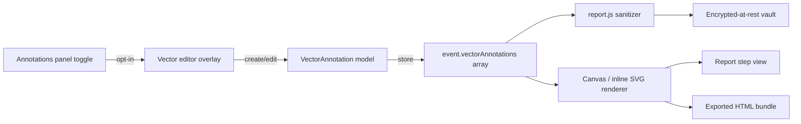
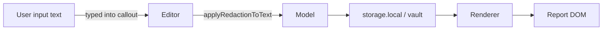

# Vector Annotation Primitives — Design Plan

Declarative arrow / box / pin / callout overlays stored alongside the existing raster annotation strokes as a new event-attached type. Backward-compatible schema addition. Rendering deferred; this document plus the visible "coming soon" toggle in report.html are the entire 2D.1 deliverable.

## Context

- Existing `event.annotation` payload carries an `imageDataUrl` (raster PNG produced by a canvas drawing tool). See report.js around the sanitizer at line 2317.
- Users want lightweight, resolution-independent callouts (arrows to point at fields, boxes framing regions, pins with sequence numbers, callouts with short text) that survive export theme changes and export bundle re-rendering.
- Constraints:
  - Air-gap: no CDN libraries (CLAUDE.md offline-only fonts and UI assets).
  - Zero new runtime dependencies. Native Canvas 2D or inline SVG only.
  - Must not silently break existing raster annotations already in stored reports (schema migration path).
  - Redaction / sanitizer must continue to work on any user text placed inside a callout.
- Non-goals: freehand vector paths, layers, undo history beyond a single stack, collaboration.

## Architecture



## Component breakdown

- **Annotations panel toggle** — checkbox in report.html (`#vector-annotations-toggle`). While the feature is a stub, the onChange handler opens this plan file via `runtime.getURL`.
- **Vector editor overlay** — deferred. Will attach to the same DOM node the raster annotator uses, but switch to an inline SVG canvas so hit-testing per primitive is O(1).
- **VectorAnnotation model** — plain object: `{ id, kind: "arrow" | "box" | "pin" | "callout", rect: {x,y,w,h} | null, from: {x,y} | null, to: {x,y} | null, text: string | null, styleId: string }`. Coordinates are normalized to the raster frame (0..1) so exports stay resolution-independent.
- **event.vectorAnnotations** — new optional array field. Absence means "no vector annotations"; presence means a list of the model above. Never replaces `event.annotation` (raster).
- **Sanitizer** — same field-level allow-list as `event.annotation`. Text field passes through `applyRedactionToText` before persist.
- **Renderer** — a stateless function `renderVectorAnnotations(ctx, annotations, frameRect)` that draws on top of the raster frame in the step view and in the exported HTML bundle.

## Data and trust boundaries



- **Trust boundary**: user-provided callout text is untrusted. It passes through the existing redaction pipeline before storage and through `textContent` (never `innerHTML`) during render.
- **At rest**: same encrypted-at-rest vault path as the rest of the report; no new persistence surface.
- **Egress**: none. No fonts, icons, or scripts are loaded from third parties.

## Code snippets

Schema shape (illustrative — not shipped yet):

```js
// event.vectorAnnotations entry
{
  id: "va_" + crypto.randomUUID(),
  kind: "arrow",
  from: { x: 0.12, y: 0.34 },
  to:   { x: 0.55, y: 0.34 },
  text: null,
  styleId: "default"
}
```

Toggle handler (shipped stub):

```js
// report.js — 2D.1 stub
if (vectorAnnotToggle) {
  vectorAnnotToggle.addEventListener("change", () => {
    try {
      const url = browser.runtime.getURL("docs/plans/vector-annotations-2026-07-16.md");
      window.open(url, "_blank", "noopener");
    } catch (_) { /* runtime unavailable in preview */ }
  });
}
```

## Sequence of work

1. **2D.1 (this build)** — plan doc + visible-but-inert checkbox stub. No schema, no renderer.
2. Introduce `VectorAnnotation` model + sanitizer allow-list entry. Optest coverage for the sanitizer path.
3. Ship the renderer for existing `event.vectorAnnotations` in the step view; export bundle inherits it automatically because the step view is what serializes.
4. Ship the SVG editor overlay; enable the checkbox to actually mount it.
5. Migration: on load, drop unknown `kind` values silently; never mutate stored raster `event.annotation`.

## Risks and mitigations

| Risk | Impact | Likelihood | Mitigation |
|------|--------|-----------|-----------|
| Schema drift breaks stored reports | High | Low | Additive-only field; loader tolerates missing/unknown |
| Callout text leaks unredacted PII | High | Medium | Run through existing `applyRedactionToText` on save |
| Renderer diverges between live view and export bundle | Medium | Medium | Single shared renderer function used by both paths |
| Editor overlay conflicts with existing raster annotator | Medium | Medium | Editor is a distinct DOM layer; toggle switches modes |
| Export theme changes make callouts unreadable | Low | Medium | Style tokens resolved at render time from the export theme |

## Alternatives considered

- **Extend raster annotator instead** — rejected: raster loses fidelity on export theme changes and cannot be re-styled without re-drawing.
- **Third-party vector library (fabric.js, konva, tldraw)** — rejected: air-gap rule forbids CDN load, and bundling any of these blows the extension size budget and adds SBOM surface.
- **Inline SVG only, no canvas** — kept as the leading option for the editor; canvas remains the leading option for the exported step image because it composites with the raster frame in one bitmap.

## Open questions

- Where does the toggle actually live in the final UI — dedicated panel or inside the raster annotator drawer?
- Do we need per-annotation style overrides (color, stroke width) in v1, or is a single style token enough?
- Should callout text be redaction-editable inline, or forced through the popup redaction rules tester?

## Out of scope

- Freehand vector path drawing.
- Multi-user collaboration / cursors.
- Undo/redo beyond a single-level stack.
- Animated / time-based annotations.
- Import of external annotation formats (JSON, Figma, SVG).
